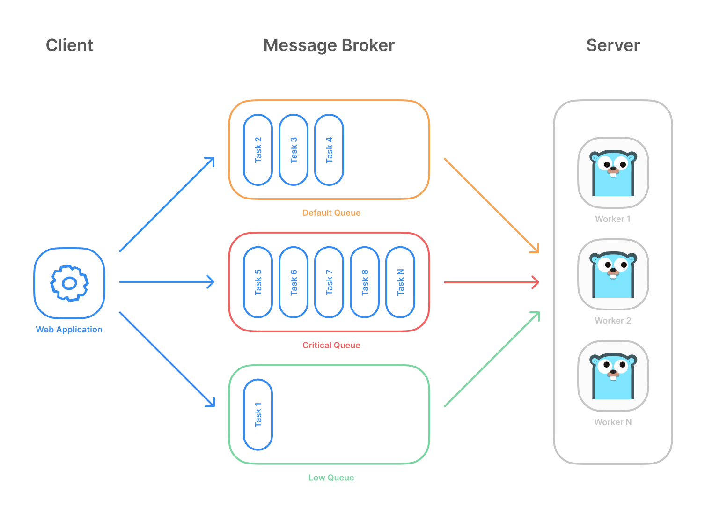

# OpenScraper Framework ( spider-common-go )

[](https://golang.org)
[](https://pkg.go.dev/github.com/anxiwuyanzu/openscraper-framework/v4)

这是一个基于 Go 语言编写的高性能、中间件驱动的数据采集与分布式爬虫基础框架。提供便捷的 API 与依赖项管理，旨在为复杂的数据采集服务提供统一标准。

## ✨ 核心目标与特性
- [x] **多重网络协议支持**：不仅支持传统的 HTTP/1.1，内置支持 HTTP/2。底层引擎可灵活切换 `fasthttp`、原生 `net/http` 或防屏蔽浏览器指纹的 `tls-client`。
- [x] **模块化中间件管线 (Pipeline)**：请求生命周期包含 `PreCheck -> PreStart -> Start -> Http Request -> Parse` 等完整的切面拦截，高度可定制化容错与重试。
- [x] **持久化流式分发 (ISinker)**：深度整合企业级基础设施。原生极简支撑 Kafka 消息队列分发数据，同时可挂载 Redis、MongoDB、MySQL / SQLx 存储服务。
- [x] **极简合理的 API 设计**：告别业务代码中满天飞的 `viper.Get`，统一的全局配置规范(`config.yaml` 或 `DOT_` 环境变量)与 `dot` 单例注入。
- [x] **完善的代理调度**：强大的多场景（芝麻、西瓜、自定义轮询等）代理智能路由与轮流锁定调度优化，支持细粒度的防封控校验拦截。
- [x] **极速的 JSON 解析机制**：内置集合了 `tidwall/gjson`、`sjson` 与基于 `json-iterator` 封装的 `util/serde`，大幅度提升大体量 JSON 处理响应能力。

## 📦 核心组件说明
本代码仓库主要包括三大核心模块：
- **`dot/`（基础单例服务启动器）**：数据采集依赖注入容器与配置中心。集合了各类存储系统/MQ，并通过 `dot.Conf()`、`dot.Logger()`、`dot.Redis()` 提供全局统一且安全的单例获取 API。
- **`spider/`（引擎调度器）**：爬虫调度与执行引擎层。内置引擎启停控制(`Engine`)与工厂挂载(`Factory`)，内置协程并发并发池与任务出入队生命周期状态。
- **`reqwest/`（网络资源管理层）**：高度定制化的请求库封装层。包含了反爬客户端引擎的包装接口、全局指纹混淆，以及动态下沉管理的各种代理。

## 🕷️ Spider 服务
Spider 执行过程在框架内被切分成多段式流转工序，极度解耦，允许在高并发处理海量数据流的同时安全、稳定运作。

系统大致架构流转流程如下图：


## ⚙️ 代理配置与扩展
针对大规模采集业务下复杂的动态资源切换设定，本框架支持按城市及并发锁分配代理白名单，使用详情请查阅 [代理配置文档](reqwest/proxz/readme.md)。

---

## 💻 快速安装

> **环境要求：Go 语言版本 >= 1.18**

```bash
go get -u github.com/anxiwuyanzu/openscraper-framework/v4
```

## 🚀 极简起步示例 (Quick Start)

框架中所有的组件均依赖 `dot` 全局配置来装载：

```go
package main

import (
	"context"
	"github.com/anxiwuyanzu/openscraper-framework/v4/dot"
	"github.com/anxiwuyanzu/openscraper-framework/v4/spider"
)

func main() {
	// 1. 初始化容器：指定前缀(DOT)和配置目录(.)，会自动解析 config.yaml
	dot.ConfigViper("DOT", ".")

	// 2. 选择性装配基础设施组件 (按需链式调用)
	dot.WithRedis().WithKafka()

	// 3. 构造 Spider 引擎实例
	engine := spider.NewEngine()

	// 4. (用户逻辑)：在这里注册自定义的 Worker 工厂到引擎中
	// engine.RegisterFactory(...)

	// 5. 启动指定名称的集群/爬虫分支任务
	engine.Start("my_spider_job")
}
```

> 🎯 **提示**: 更详细的爬虫示例与深度用法，请参考仓库中的 [examples](examples) 目录进行全盘了解，也可以阅读各模块包根目录下的 `doc.go` 以及 `tests/` 目录。
